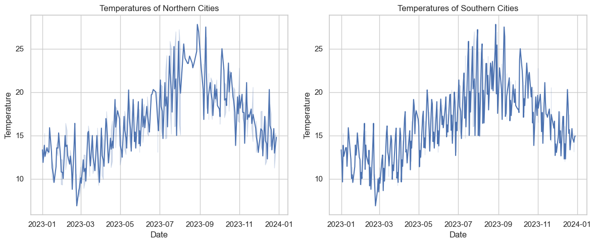
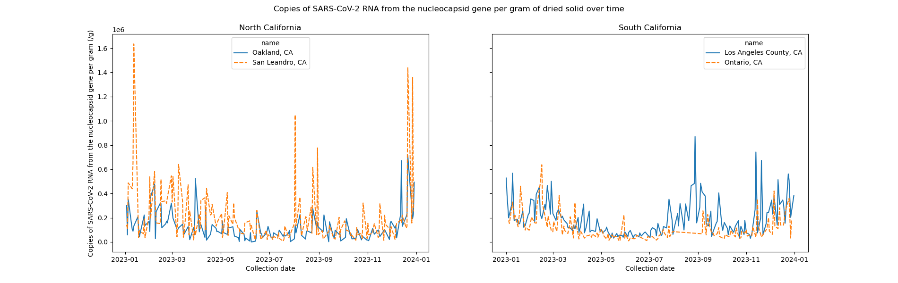
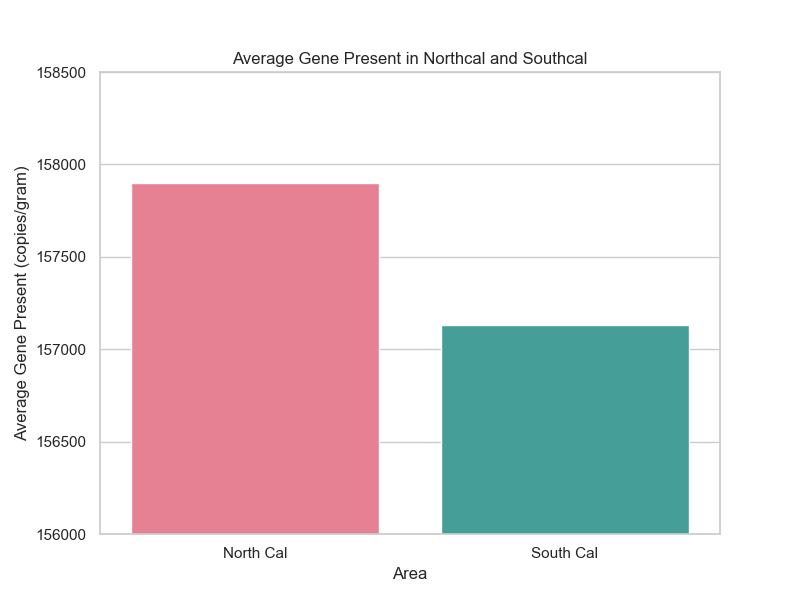

# Project 3 - Wastewater Epidemiology & SARS COV-2 Detection
#### By Matthew Garcia, Long Le, Gwendolyn Lukman, and Bob Hulsy

# Introduction
Our project is to monitor the rate of Covid in California last year (2023) using wastewater epidemiology. 

In the last few days, the California storm has been making the cold of winter feels way worse. Combine with some Covid outbreaks in the 2023, we have been thinking: How can the weather affect the probability of catching Covid? As we all know, it is easier to catch a cold or a common flu when the weather get cold. We hypothesize that Covid also transmit better in lower temperature, suggesting a seasonal pattern in virus spread. 

### Hypothesis: SARS-Cov-2 Transmission increases with drops in temperature, suggesting a seasonal pattern in virus spread.

# Data
* Wastewater Genomic Data

The data is daily collected from different wastewater sites in North California and South California. It measures the copies of SARS-Cov-2 RNA (Severe acute respiratory syndrome coronavirus 2) from the nucleocapsid gene per gram of dried solid. This way, we can avoid missing asymptomatic individuals or those that don’t do the testing. To test our hypothesis, we needed N_gene concentrations available by collection date. This data was readily available via Wastewaterscan.org

* Weatherbit API

This API could produce weather data specific to the locations and and specific to the date of the wastewater collection.

# Analysis
#### Cleaning.ipynb
From the Wasterwaterscan.org, we cleaned the data and filter out the cities we didn't want to analyze
#### Merging_data.ipynb
With the weather data from the API, we averaged the max_temp and min_temp and merged the data with the dataset we have from Cleaning.ipynb
#### Uploading the data to MongoDB
We uploaded the datasets to mongoDB
#### Visualizations.ipynb
Here we used seaborn to do most of our visualizations.

# Visualizations

Our first visualization is of our temperature data from our chosen cities, Our cities experienced the seasons at the same time which is why they lines follow the same trend, but you can see the Southern cities are consistently warmer.

 Our second visualization is the amount of N-gene per gram over a years time for the northern and southern cities. We can see that it is more abundant in the northern cities which suggests a trend. This is not enough to say it is the cause but it is a sign that there could be a link.

Our last visualization shows the average amount of present and we can see that the northern cities have a higher average than the southern cities. This means that covid is more prevalent in our northern cities. We made this webpage using Html Css and java script

# Website
#### Folder: display
This folder consist of the html and css file to make our website. To access our website, please use this link: http://htmlpreview.github.io/?https://raw.githubusercontent.com/gwenlukman/Project-3/main/display/vis.html
# What we Learned
* Cold weather leads to increased transmission of SARS-CoV-2.
* Genomic testing of wastewater is effective for community testing.
* Wastewater Epidemiology holds great promise for future data analysis

# Limitations of Current Technique
* Is transmission linked to weather or seasonal indoor gathering?
* Beyond air temperature, what role does humidity play in transmission?
* What role does indoor ventilation play in transmission, and what could be possible best practices for minimizing the risk of airborne pathogens?

